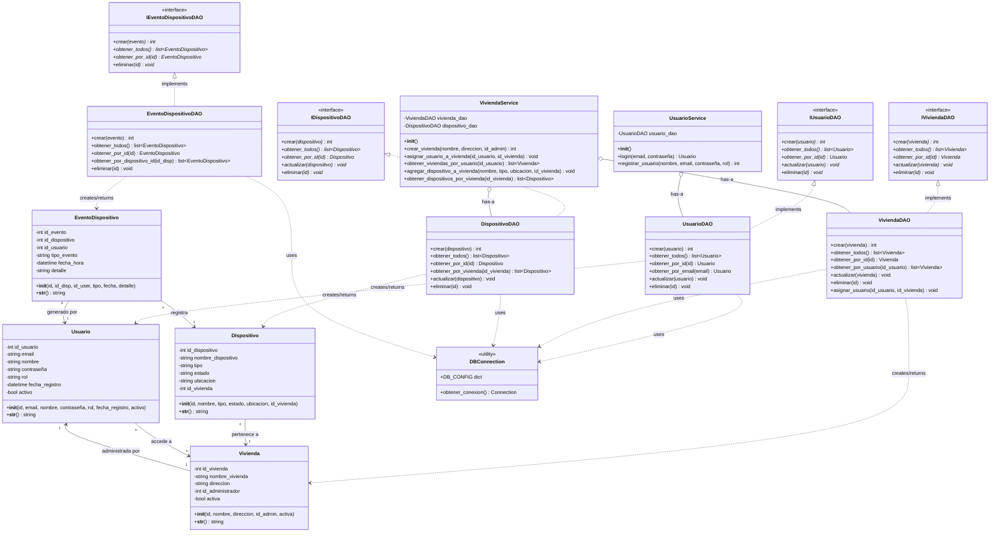

# Diagrama de Clases - SmartHome (Evidencia 6 - Patrón DAO)

Este diagrama representa la arquitectura actual del sistema SmartHome con el patrón Data Access Object (DAO), mostrando la separación entre la capa de dominio, acceso a datos y servicios.

## Diagrama UML en Mermaid

## Descripción de las Capas

### 1. Capa de Dominio (Entidades)
Las clases de dominio representan las entidades del negocio:
- **Usuario**: Representa a un usuario del sistema con credenciales y rol.
- **Vivienda**: Representa una casa inteligente con su información y administrador.
- **Dispositivo**: Representa un dispositivo IoT (luz, termostato, cámara, etc.).
- **EventoDispositivo**: Registra las acciones realizadas sobre los dispositivos.

### 2. Capa de Acceso a Datos (DAO)

#### Interfaces DAO
Definen los contratos que deben cumplir las implementaciones:
- **IUsuarioDAO**, **IViviendaDAO**, **IDispositivoDAO**, **IEventoDispositivoDAO**
- Métodos estándar: `crear()`, `obtener_todos()`, `obtener_por_id()`, `actualizar()`, `eliminar()`

#### Implementaciones DAO
Clases concretas que implementan las interfaces y manejan las operaciones CRUD:
- **UsuarioDAO**: Gestión de usuarios en la base de datos.
- **ViviendaDAO**: Gestión de viviendas y relación con usuarios.
- **DispositivoDAO**: Gestión de dispositivos asociados a viviendas.
- **EventoDispositivoDAO**: Registro de eventos en la base de datos.

### 3. Capa de Servicios (Lógica de Negocio)
Orquesta las operaciones de negocio usando los DAOs:
- **UsuarioService**: Maneja el login y registro de usuarios.
- **ViviendaService**: Coordina la creación de viviendas, asignación de usuarios y gestión de dispositivos.

### 4. Conexión a Base de Datos
- **DBConnection**: Utilidad que provee conexiones a MySQL.

## Patrones de Diseño Aplicados

1. **DAO (Data Access Object)**: Separa la lógica de persistencia de la lógica de negocio.
2. **Interface/Abstract Class**: Define contratos para las implementaciones DAO.
3. **Service Layer**: Encapsula la lógica de negocio y coordina operaciones.
4. **Dependency Injection**: Los servicios reciben instancias de DAOs.

## Ventajas de esta Arquitectura

✅ **Separación de responsabilidades**: Cada capa tiene un propósito específico.  
✅ **Testabilidad**: Las interfaces permiten crear mocks para pruebas.  
✅ **Mantenibilidad**: Los cambios en la BD no afectan la lógica de negocio.  
✅ **Escalabilidad**: Fácil agregar nuevas entidades o servicios.  
✅ **Reutilización**: Los DAOs pueden usarse en múltiples servicios.
